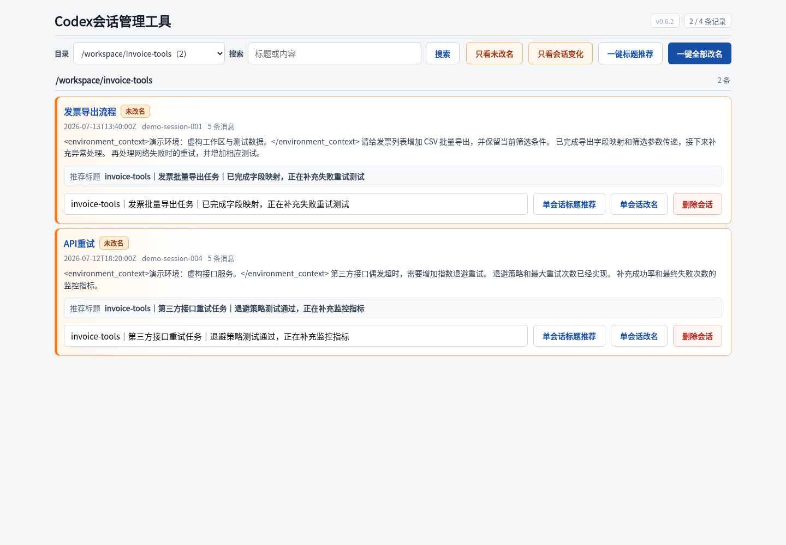
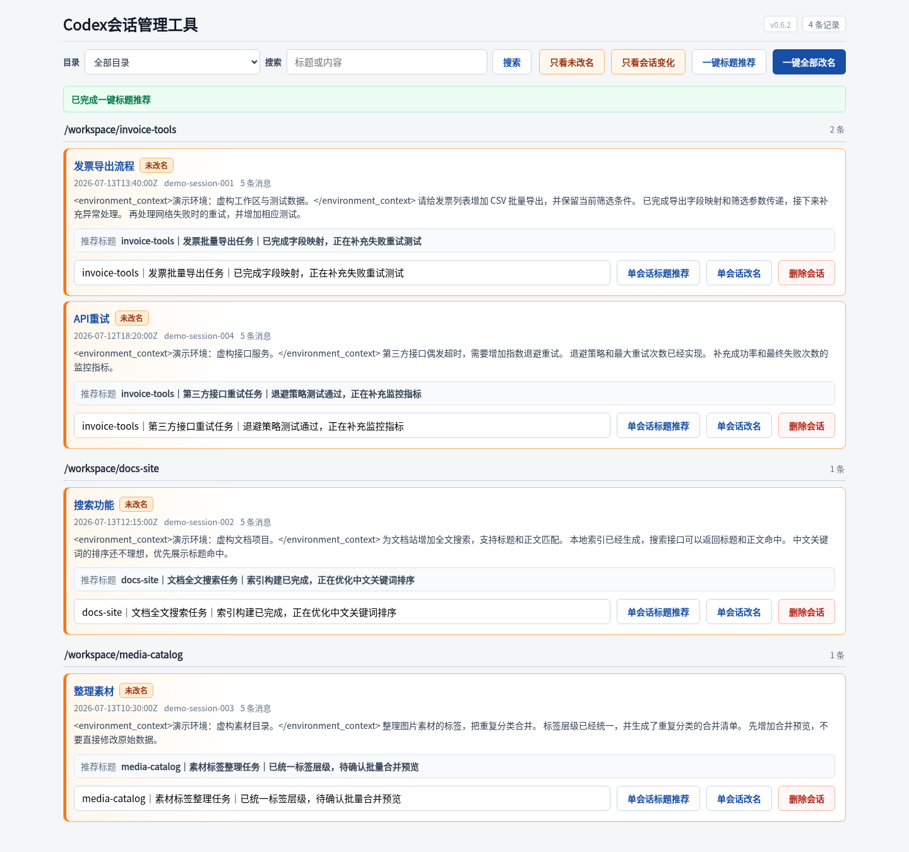
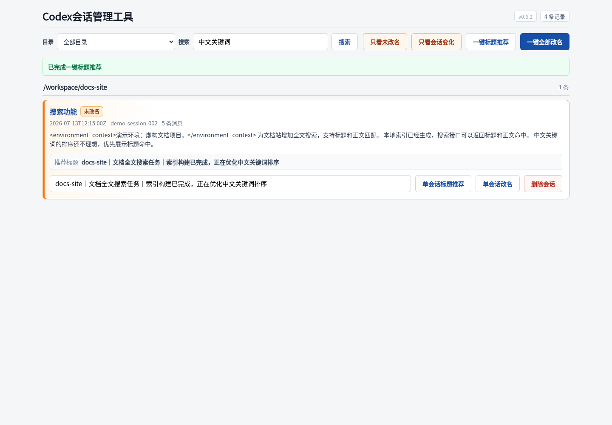
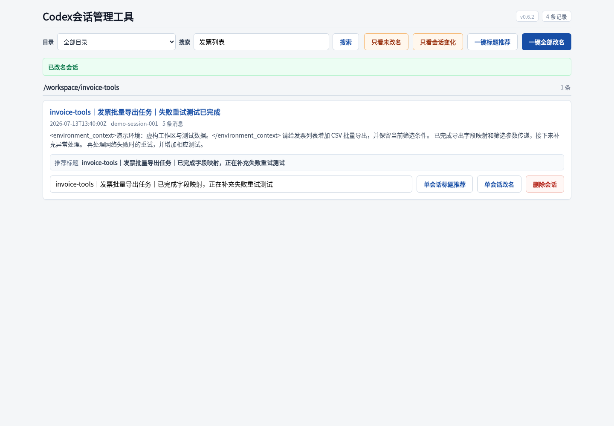
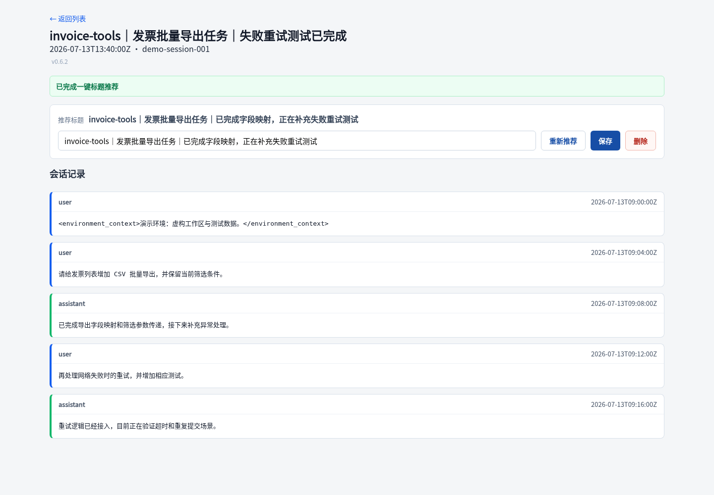

# Codex Session Renamer

[English](./README.md) | [简体中文](./README.zh-CN.md)

> Current version: v0.8.0

A local web interface for reviewing, renaming, and cleaning up Codex sessions. The UI is Chinese and is designed for people who maintain many sessions across multiple project directories.

## Features

### Session discovery and review

- Reads both the legacy `~/.codex/session_index.jsonl` index and the current `~/.codex/state_5.sqlite` database.
- Matches active logs under `~/.codex/sessions/**` and archived logs under `~/.codex/archived_sessions/`.
- Groups sessions by working directory and sorts them from most recently updated to oldest.
- Shows session title, update time, ID, message count, preview, and recommendation directly in the list.
- Provides a detail view for reviewing the user and assistant messages in a session.
- Searches by current title, preview, and conversation content.
- Filters sessions that still need a useful name or have changed since their last successful rename.

### Title recommendations and renaming

- Generates a three-level title: current directory, overall summary, and the most recent two-turn summary.
- Uses `qwen3.5-flash` through the DashScope-compatible API, with thinking disabled for low-cost title generation.
- With recent context, a successful recommendation uses four Qwen calls: overall generation, one structured overall quality review/correction, recent-state generation, and recent-state review. If the overall review rejects the candidate, processing stops after that review.
- Treats paths, filenames, screenshots, and files as evidence carriers, not sufficient task objects. Invalid or unacceptable results produce no recommendation.
- Includes recent assistant evidence and bounds the combined overall evidence within a conservative 100,000-character input envelope. The implementation reserves prompt overhead, caps recent evidence at 20,000 characters, and budgets long sessions across the original task and latest intent; this is not an exact tokenizer-based 100,000-token limit.
- Ignores the first user environment/context record when building title context.
- Allows a model-owned overall task segment to evolve when an explicit recommendation is refreshed after the conversation changes. A manually authored overall segment stays protected, so only its recent-state segment is updated.
- Passive list and detail refreshes never call Qwen. Only explicit title actions—recommendation, auto-rename, or the suggestion API—can invoke the model.
- Prefills each rename input with its current recommendation without applying the rename automatically.
- Keeps recommendation generation separate from renaming, so generating recommendations does not change session count or current names.
- Supports manual rename directly in the list and filtered bulk rename.
- Uses the Codex `thread/name/set` app-server method for current sessions so names persist after the conversation continues.

### Change tracking and cleanup

- Marks a session as changed when its content differs from the content at the last successful rename.
- Keeps a changed session visible after recommendation generation and clears the state only after a successful rename.
- Deletes sessions from the index/database while moving logs to `~/.codex/session-renamer-trash/` for recovery.
- Creates timestamped backups before modifying the legacy index or current state database.
- Shows temporary success messages after recommendation, rename, bulk rename, and deletion actions.

### Performance and privacy

- Does not send session content anywhere unless Qwen title generation is explicitly configured and triggered.
- Caches recommendations and log metadata to avoid repeatedly parsing unchanged session files.
- Loads full conversation details only for detail pages, content search, changed-session filtering, and title generation.
- Supports an optional application access token for every session-management page and action.
- Binds to loopback by default; tokenless mode is intended only for local use or an authenticated HTTPS reverse proxy.
- Sends `Cache-Control: no-store` responses to reduce browser caching of private transcripts.

## Requirements

- Python 3.10 or newer
- A Codex installation with `app-server` support for persistent renaming
- Access to the Codex data directory, normally `~/.codex`

## Install

```bash
git clone https://github.com/zhangyanbo2007/codex-session-renamer.git
cd codex-session-renamer
python3 -m venv .venv
.venv/bin/pip install -e .
```

Start the loopback-only local service:

```bash
bash run.sh
```

Open:

```text
http://127.0.0.1:8891/
```

To add application-level authentication, create a strong random token before starting:

```bash
export SESSION_RENAMER_TOKEN="$(python3 -c 'import secrets; print(secrets.token_urlsafe(32))')"
bash run.sh
```

Then open:

```text
http://127.0.0.1:8891/?token=<SESSION_RENAMER_TOKEN>
```

The launcher uses `PYTHON` when supplied, then `.venv/bin/python`, then `python3` from `PATH`.

## Workflow walkthrough

> All sessions, directories, titles, messages, IDs, and timestamps in the screenshots below are fictional demonstration data. No real Codex conversation data is shown.

### 1. Browse, filter, and search sessions

Choose a working directory or search by title and conversation content. The list keeps rename, recommendation, and deletion controls available without opening the detail page.



### 2. Generate title recommendations

Click **一键标题推荐** to refresh recommendations for the current filtered result. This action only fills recommendation and rename fields; it does not rename sessions.



### 3. Recommend a title for one session

Use search to isolate a session, then click **单会话标题推荐**. The generated three-level title is placed in that session's rename input for review and editing.



### 4. Apply a reviewed title

Edit the prefilled value when needed and click **单会话改名**. A temporary success message confirms that the rename was applied.



### 5. Review the conversation before cleanup

Open a session title to inspect its messages, refresh the recommendation, save a new title, or delete the session after review.



## Usage

Configure Qwen before requesting title recommendations:

```bash
export SESSION_RENAMER_DASHSCOPE_API_KEY='your-dashscope-api-key'
export SESSION_RENAMER_QWEN_MODEL='qwen3.5-flash'
export SESSION_RENAMER_TOKEN='your-strong-access-token'
bash run.sh
```

After opening the web interface:

1. Use the directory selector or search box to narrow the session list. Search matches current titles, previews, and conversation content.
2. Click **一键标题推荐** to regenerate recommendations for the currently displayed sessions. This does not rename sessions or change the session count.
3. Click **单会话标题推荐** to regenerate one recommendation and place it in that session's rename input.
4. Review or edit the input, then click **单会话改名** to apply one title.
5. Click **一键全部改名** to apply recommendations to the currently filtered sessions.
6. Open a session title to review its messages, regenerate its recommendation, rename it, or delete it from the detail page.
7. Use **只看未改名** for sessions without a three-level title. Use the changed-session filter for conversations updated since their last applied rename.
8. Delete only after reviewing the session. Deleted logs are moved to `~/.codex/session-renamer-trash/` and index/database backups are created first.

The title format is `current directory | overall task | recent two-turn state`. Passive list and detail refreshes never invoke Qwen; only explicit recommendation, auto-rename, or suggestion-API actions may generate a title.

## Configuration

Copy `.env.example` as a reference, but export secrets into the process environment or store them in a protected local file that is not committed.

| Variable | Required | Default | Purpose |
| --- | --- | --- | --- |
| `SESSION_RENAMER_TOKEN` | No | empty | Access token for all private pages and actions; when empty, application authentication is disabled |
| `CODEX_HOME` | No | `~/.codex` | Codex data directory |
| `SESSION_RENAMER_INDEX_PATH` | No | `$CODEX_HOME/session_index.jsonl` | Legacy index override |
| `SESSION_RENAMER_HOST` | No | `127.0.0.1` | Local bind address |
| `SESSION_RENAMER_PORT` | No | `8891` | Local HTTP port |
| `SESSION_RENAMER_PUBLIC_URL` | No | empty | Public HTTPS URL shown by the FRP helper and used for its direct health check |
| `SESSION_RENAMER_CODEX_BIN` | No | auto-detected | Codex executable with app-server support |
| `SESSION_RENAMER_TITLE_PROVIDER` | No | `qwen` | Use `local` to keep existing titles without recommendations |
| `SESSION_RENAMER_DASHSCOPE_API_KEY` | For Qwen | none | DashScope API key |
| `SESSION_RENAMER_QWEN_MODEL` | No | `qwen3.5-flash` | Title-generation model |
| `SESSION_RENAMER_QWEN_BASE_URL` | No | DashScope compatible endpoint | API endpoint override |
| `SESSION_RENAMER_QWEN_TIMEOUT` | No | `8` | Model request timeout in seconds |
| `SESSION_RENAMER_QWEN_PROXY` | No | detected local proxy or none | HTTP(S) proxy for model requests |
| `SESSION_RENAMER_TITLE_WORKERS` | No | `6` | Maximum parallel title requests |

Title semantics are generated only by Qwen. When no API key is present, the app keeps existing titles instead of applying local title rules.

## Optional FRP exposure

FRP is not required for local use. The included `frp-tunnel.sh` is a generic helper and reads optional machine-specific settings from the ignored `.env.local` file.

Required FRP values:

```bash
export SESSION_RENAMER_FRP_CONFIG=/path/to/frpc.toml
export SESSION_RENAMER_PUBLIC_HOST=example.com
bash frp-tunnel.sh start
```

Choose one authentication boundary before exposing the tunnel:

- Set `SESSION_RENAMER_TOKEN` to keep application-level token authentication enabled.
- Or place an authenticated HTTPS reverse proxy in front of the VPS-internal FRP port, leave `SESSION_RENAMER_TOKEN` unset, and set `SESSION_RENAMER_PUBLIC_URL` to the public HTTPS URL.

Additional variables include `SESSION_RENAMER_PUBLIC_URL`, `SESSION_RENAMER_FRP_BIN`, `SESSION_RENAMER_FRP_ADMIN`, `SESSION_RENAMER_FRP_PROXY_NAME`, `SESSION_RENAMER_REMOTE_PORT`, `SESSION_RENAMER_FRP_MANAGE_CONFIG`, `SESSION_RENAMER_LOG_FILE`, and `SESSION_RENAMER_PID_FILE`.

Validate configuration without starting anything:

```bash
bash frp-tunnel.sh validate
```

Start, inspect, or stop the local service while leaving the shared FRP client intact:

```bash
bash frp-tunnel.sh start
bash frp-tunnel.sh status
bash frp-tunnel.sh stop
```

When `SESSION_RENAMER_PUBLIC_URL` is configured, `status` checks it directly without the local outbound proxy. An HTTP response proves the transport path is reachable; this includes the expected `401` from an authenticated reverse proxy.

> FRP TCP forwarding does not add TLS or authentication. Codex transcripts can contain source code, credentials, personal information, and system context. Prefer a trusted private network. Never expose tokenless mode directly to the internet: the reverse proxy must enforce authentication on every management route.

## Safety notes

- Back up `~/.codex` before first use.
- Review recommendations before bulk rename.
- Deletion changes Codex indexes and moves logs into a local trash directory; verify the selected directory and search filters first.
- Tokenless mode disables application authentication. Keep the default loopback bind unless every public management route is protected by an authenticated HTTPS reverse proxy.
- A token in a query string may appear in browser history and intermediary logs. Use a private network and rotate the token if it may have been exposed.
- Model-based recommendations send cleaned conversation context to the configured provider only after the recommendation action is triggered.

## Development

Run the complete test suite:

```bash
python3 -m unittest discover -s tests -v
```

The test suite uses injected fake model responses and never makes live Qwen calls.

Check shell scripts and whitespace:

```bash
bash -n run.sh frp-tunnel.sh
git diff --check
```

See [CHANGELOG.md](./CHANGELOG.md) for release history.

## License

MIT
